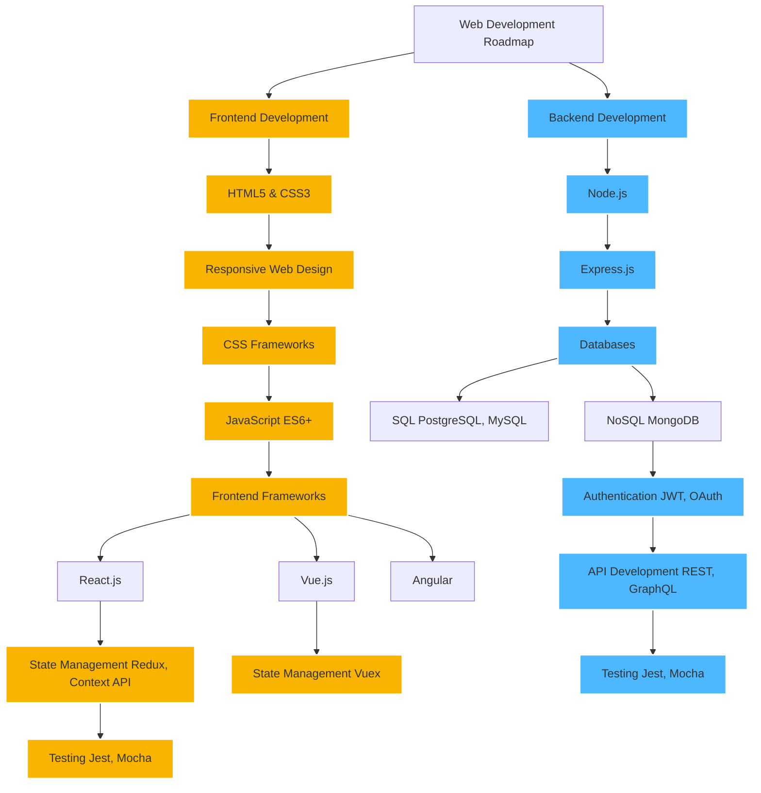

# Web Development Roadmap

```mermaid
flowchart TD
    A[Web Development Roadmap] --> B[Frontend Development]
    A --> C[Backend Development]
    
    B --> B1[HTML5 & CSS3]
    B1 --> B2[Responsive Web Design]
    B2 --> B3[CSS Frameworks]
    B3 --> B4[JavaScript ES6+]
    B4 --> B5[Frontend Frameworks]
    B5 --> B51[React.js]
    B5 --> B52[Vue.js]
    B5 --> B53[Angular]
    B51 --> B6[State Management Redux, Context API]
    B52 --> B7[State Management Vuex]
    B6 --> B8[Testing Jest, Mocha]
    
    C --> C1[Node.js]
    C1 --> C2[Express.js]
    C2 --> C3[Databases]
    C3 --> C31[SQL PostgreSQL, MySQL]
    C3 --> C32[NoSQL MongoDB]
    C32 --> C4[Authentication JWT, OAuth]
    C4 --> C5[API Development REST, GraphQL]
    C5 --> C6[Testing Jest, Mocha]
    
    classDef frontend fill:#f8b400,stroke:#fff,stroke-width:2px;
    classDef backend fill:#4db8ff,stroke:#fff,stroke-width:2px;
    class B frontend;
    class C backend;
    
    class B1,B2,B3,B4,B5,B6,B7,B8 frontend;
    class C1,C2,C3,C4,C5,C6 backend;
```

## Any website contains two parts:-
  <ol>
    <li>Frontend </li>
      <ul>
        <li>Front-end have everything </li>
      </ul>
  </ol>
