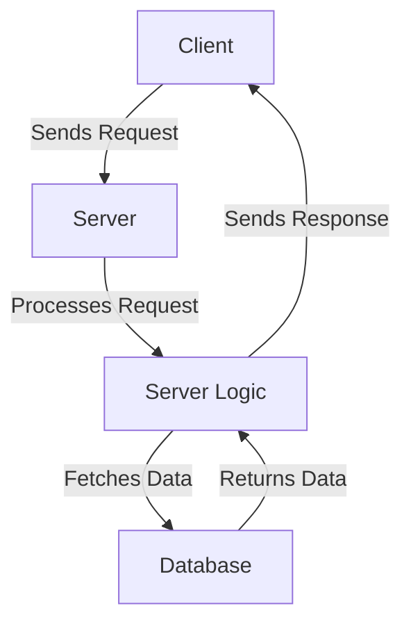

<h1><b>HTML</b></h1>

## Role of HTML in Web Development
<ul>
  <li>HTML - HTML stands for <b>Hyper text markup language.</b></li>
  <li>It is used to <b>build the Skeleton of the Website.</b></li>
  <li>It is the standard language used to create and structure content on the web. It tells the web browser how to display text, links, images, and other forms of multimedia on a webpage.</li>

  
</ul>

## Basics of HTML

### HTML Tags :-
  <ul>
    <li>An HTML tag is the raw syntax used to define elements in an HTML document.</li>
    <li>Tags typically come in pairs:-</li>
    <ol>
      <li>Opening Tag :-  &lt/tagname&gt </li>
      <li>Closing Tag :- &lt/tagname&gt </li>
    </ol>
  </ul>

**NOTE:-** Self-closing tags: These tags do not have a closing tag, and they represent elements that don’t need any content inside them.

### Html Elements :-
<ul>
  <li>An element refers to the entire structure that includes both the opening and closing tags as well as the content inside. </li>
  <LI>The element defines a section of the web page's content and how it should be treated or displayed.</LI>
  <LI>An HTML element consists of:</LI>
    <OL>
      <LI>Opening tag</LI>
      <li>Content (optional)</li>
      <li>Closing tag</li>
    </OL>
</ul>
    

