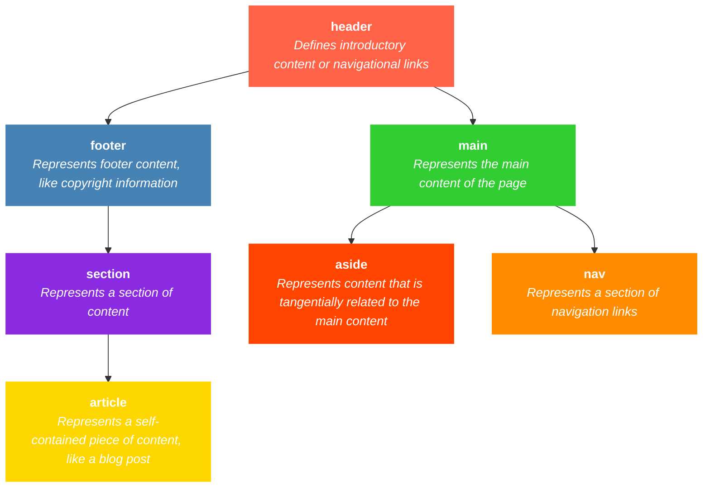

<h1><b>HTML</b></h1>

## Role of HTML in Web Development
<ul>
  <li>HTML - HTML stands for <b>Hyper text markup language.</b></li>
  <li>It is used to <b>build the Skeleton of the Website.</b></li>
  <li>It is the standard language used to create and structure content on the web. It tells the web browser how to display text, links, images, and other forms of multimedia on a webpage.</li>

  
</ul>

## Basics of HTML

### HTML Tags :-
  <ul>
    <li>Syntax used to create elements.</li>
    <li>An HTML tag is the raw syntax used to define elements in an HTML document.</li>
    <li>Tags typically come in pairs:-</li>
    <ol>
      <li>Opening Tag :-  &lt/tagname&gt </li>
      <li>Closing Tag :- &lt/tagname&gt </li>
    </ol>
  </ul>

**NOTE:-** Self-closing tags: These tags do not have a closing tag, and they represent elements that don’t need any content inside them.


### Html Elements :-
<ul>
  <li> Building block of HTML. </li>
  <li>An element refers to the entire structure that includes both the opening and closing tags as well as the content inside. </li>
  <LI>The element defines a section of the web page's content and how it should be treated or displayed.</LI>
  <LI>An HTML element consists of:</LI>
    <OL>
      <LI>Opening tag</LI>
      <li>Content (optional)</li>
      <li>Closing tag</li>
    </OL>
</ul>

### Boilerplate code::-
  ```HTML
<!DOCTYPE html>
<html lang="en">
<head>
    <title>Document</title>
</head>
<body>
   <!--Content--> 
</body>
</html>
```

**html:** The root element that wraps all the content on the page.

**head:** Contains metadata about the webpage (such as title, charset, and links to external files like stylesheets or scripts).

**body:** Contains all the visible content of the webpage.

**header:** Typically used for introductory content, like the website name or navigation.

**footer:** Generally used for closing content, such as copyright information or links.

### Common HTML Elements :-

<ol>
  <li> <B>h1 to h6:</B> These tags are used to define headings. h1 is the most important and largest, while h6 is the least important and smallest.</li>


  ```HTML
    <h1>Himanshu 1</h1>
    <h2>Himanshu 2</h2>
    <h3>Himanshu 3</h3>
    <h4>Himanshu 4</h4>
    <h5>Himanshu 5</h5>
    <h6>Himanshu 6</h6>
```
 **OUTPUT:-**
    <h1>Himanshu 1</h1>
    <h2>Himanshu 2</h2>
    <h3>Himanshu 3</h3>
    <h4>Himanshu 4</h4>
    <h5>Himanshu 5</h5>
    <h6>Himanshu 6</h6>


<LI><b>p:</b> Defines a paragraph of text.</LI>

```HTML
  <p>This is a paragraph of text.</p>
```

 **OUTPUT:-**
<p>This is a paragraph of text.</p>


<LI><b>a:</b> Defines a hyperlink. It requires the href attribute to point to the target URL.</LI>

```HTML
<a href="https://example.com">Click here to visit Example</a>
```
 **OUTPUT:-**
 <a href="https://example.com">Click here to visit Example</a>

 <LI><b>ul:</b> Defines an unordered list (bulleted list).</LI>

 ```HTML
<ul>
    <li>Item 1</li>
    <li>Item 2</li>
    <li>Item 3</li>
</ul>
```
 **OUTPUT:-**

<ul>
    <li>Item 1</li>
    <li>Item 2</li>
    <li>Item 3</li>
</ul>

<LI><b>ol:</b> Defines an ordered list (numbered list).</LI>

```HTML
<ol>
    <li>Step 1</li>
    <li>Step 2</li>
    <li>Step 3</li>
</ol>
```
 **OUTPUT:-**
<ol>
    <li>Step 1</li>
    <li>Step 2</li>
    <li>Step 3</li>
</ol>
</ol>

###  Structuring Content with Semantic HTML: 

  <li>Semantic HTML refers to using HTML elements that clearly describe their meaning both to the browser and the developer. This improves accessibility, SEO, and the readability of the code.</li>
 


### Nesting
<li>Nesting: Refers to placing one HTML element inside another. For example, a list (ul) can contain list items (li).</li>

```HTML
<ul>
    <li><a href="#">Link 1</a></li>
    <li><a href="#">Link 2</a></li>
</ul>
```

 **OUTPUT:-**
 <ul>
    <li><a href="#">Link 1</a></li>
    <li><a href="#">Link 2</a></li>
</ul>

### Attributes

<li>Attributes: Provide additional information about an element. For example, the href attribute specifies the destination of a link in an anchor tag (a).</li>

```Html
<a href="https://example.com">Visit Example</a>
```

<hr/>

### HTML Tables

<li>HTML tables allow you to organize data into rows and columns.</li>

<b>Basic Table Structure</b>

```html
<table>
  <tr>
    <th>Heading 1</th>
    <th>Heading 2</th>
  </tr>
  <tr>
    <td>Data 1</td>
    <td>Data 2</td>
  </tr>
</table>
```

 **OUTPUT:-**

 <table>
  <tr>
    <th>Heading 1</th>
    <th>Heading 2</th>
  </tr>
  <tr>
    <td>Data 1</td>
    <td>Data 2</td>
  </tr>
</table>


<ol>
  <li><b>table:</b> Starts the table.</li>
  <li><b>tr:</b> Table row.</li>
  <li><b>th:</b> Table heading (bold & centered by default).</li>
  <li><b>td:</b> Table data cell.</li>
</ol>

<li>Always include thead, tbody, and tfoot for better readability and accessibility.</li>

```HTML
<table>
  <thead>
    <tr>
      <th>Item</th>
      <th>Price</th>
    </tr>
  </thead>
  <tbody>
    <tr>
      <td>Pen</td>
      <td>$1</td>
    </tr>
    <tr>
      <td>Notebook</td>
      <td>$3</td>
    </tr>
  </tbody>
  <tfoot>
    <tr>
      <td>Total</td>
      <td>$4</td>
    </tr>
  </tfoot>
</table>

```

**OUTPUT:-**

<table>
  <thead>
    <tr>
      <th>Item</th>
      <th>Price</th>
    </tr>
  </thead>
  <tbody>
    <tr>
      <td>Pen</td>
      <td>$1</td>
    </tr>
    <tr>
      <td>Notebook</td>
      <td>$3</td>
    </tr>
  </tbody>
  <tfoot>
    <tr>
      <td>Total</td>
      <td>$4</td>
    </tr>
  </tfoot>
</table>

### <B>`colspan` and `rowspan` in HTML Tables</b>

In HTML tables, `colspan` and `rowspan` are attributes used to **merge cells across columns or rows**, respectivel

🔹 `colspan` – Merge Columns

The `colspan` attribute allows a cell to span across **multiple columns**.

Example: Cell spanning 2 columns

```html
<table border="1">
  <tr>
    <th>Name</th>
    <th>Age</th>
  </tr>
  <tr>
    <td colspan="2">Himanshu (merged columns)</td>
  </tr>
</table>

```

**OUTPUT :-**

<table border="1">
  <tr>
    <th>Name</th>
    <th>Age</th>
  </tr>
  <tr>
    <td colspan="2">Himanshu  (merged columns)</td>
  </tr>
</table>


🔸 `rowspan` – Merge Rows

The `rowspan` attribute allows a cell to span across **multiple rows**.

Example: Cell spanning 2 rows

```html
<table border="1">
  <tr>
    <th rowspan="2">Name</th>
    <td>Himanshu</td>
  </tr>
  <tr>
    <td>Kapil</td>
  </tr>
</table>
```

**OUTPUT :-**
<table border="1">
  <tr>
    <th rowspan="2">Name</th>
    <td>Himanshu</td>
  </tr>
  <tr>
    <td>Kapil</td>
  </tr>
</table>


    


